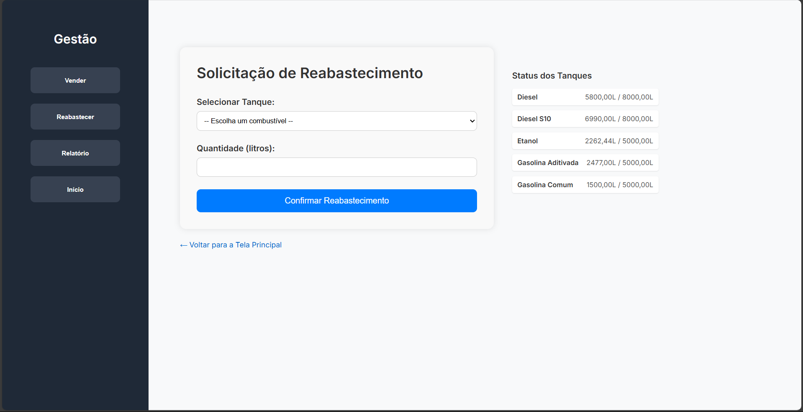
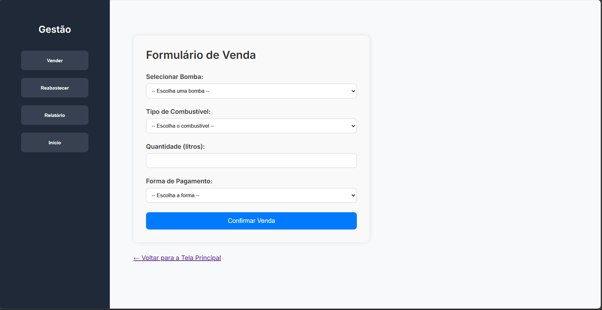
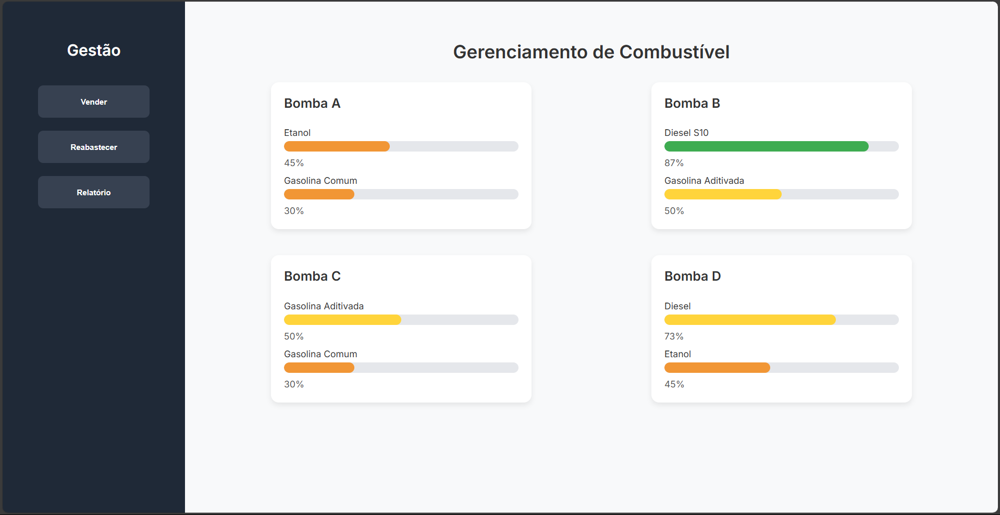

# ⛽ Sistema de Gestão de Postos de Combustíveis

Desenvolvedores: Jhony Santos, Karleandro Silva, Lucas Farias, Rian Carlos, Washington Gaia.

---

## 📌 Descrição

Este projeto consiste em um **Sistema de Gestão de Postos de Combustível**, desenvolvido pelos discentes do curso de Ciência da Computação - UFAL Arapiraca, com foco acadêmico para simular a operação de uma plataforma de gerenciamento e vendas de combustíveis: Gasolina, Aditivada, Etanol e Diesel. Utiliza estórias de usuários para facilitar a construção de funções relevantes para o sistema.

O sistema foi desenvolvido com base nos princípios da arquitetura MVT, cuja abordagem é utilizada em Django para organizar a base de dados e o fluxo de trabalho em desenvolvimento web. O padrão MVT é composto por **model**, **view** e **template**, que tornam o sistema mais robusto, organizado e seguro.

---

## 🛠️ Funcionalidades

1. **Realizar venda**:
   - O sistema será operado sob a perspectiva do funcionário e disponibilizará quatro tipos de combustíveis. Cada um possui um preço específico. No momento da venda, o funcionário informará a quantidade, em litros, do combustível escolhido. O sistema calculará automaticamente o valor total, multiplicando a quantidade pelo preço correspondente. O pagamento poderá ser realizado em dinheiro, cartão (crédito/débito) e PIX.

2. **Reabastecer**:
   - Cada bomba contará com dois tanques de combustível. À medida que as vendas forem realizadas, o nível dos tanques será reduzido. O sistema utilizará três cores — verde, amarelo e vermelho — para representar os diferentes níveis de combustível. Quando um tanque atingir o nível vermelho, indicando baixo volume, será necessário realizar o reabastecimento.

3. **Gerar Relatório**:
   - Será gerado um relatório em formato de tabela, contendo informações detalhadas sobre as vendas realizadas. Serão exibidos: data e hora da venda, bomba utilizada (A, B, C ou D), tipo de combustível, quantidade vendida em litros, forma de pagamento e o valor a ser pago (calculado com base na quantidade de litros). No canto inferior direito da tabela, será apresentado o valor total arrecadado.

4. **Visualizar Estoque**:
   - Interface dedicada para exibir, em tempo real, os níveis de cada tanque associado às bombas.

5. **Emitir Alerta de Nível Crítico**:
   - O sistema emite alertas automáticos quando um tanque atinge um volume inferior ao mínimo estabelecido, auxiliando na gestão proativa do abastecimento.

---

## 💻 Tecnologias Utilizadas

| Categoria              | Ferramenta/Tecnologia                    |
|------------------------|------------------------------------------|
| Linguagem              | Python                                   |
| Framework Web          | Django                                   |
| Banco de Dados         | SQLite3                                  |
| Frontend               | Django Templates, HTML, CSS e JavaScript |
| Ambiente Virtual       | venv (Python Virtual Environment)        |
| Gerenciador de Pacotes | pip                                      |
| Sistema Operacional    | Compatível com Windows e Linux           |

      python, JS (node.js) nas versões mais atuais e Django na versão 5.2.1
---

## 👨‍💻 Comando para rodar o código

      python manage.py runserver

---

## 📂 Estrutura do Projeto

A estrutura do projeto segue o padrão Django e está organizada com base na arquitetura MVT. Os principais arquivos incluem:

- `models.py` — Entidades: Tanque, Bomba, Abastecimento.
- `views.py` — Funções para renderização de páginas.
- `urls.py` — Rotas: página inicial, tanques, bombas e abastecimentos.
- `admin.py` — Integração com o painel administrativo do Django.

---

## 📸 Interface Visual

A seguir, estão representações visuais das telas desenvolvidas para o sistema. Certifique-se de que as imagens estejam salvas na pasta `/imagens/` do repositório:

### 🔄 Reabastecer

  
*Figura 1 - Tela de Reabastecimento*

### 📊 Relatório

  
*Figura 2 - Tela de Relatório*

### ⛽ Vendas

  
*Figura 3 - Tela de Vendas*

### 🛢️ Gerenciamento de Combustível

  
*Figura 4 - Tela de Gerenciamento de Combustível*

O sistema possui quatro cores para representar os níveis dos combustíveis, como: **vermelho** (crítico), **laranja** (abaixo da média - 50%), **amarelo** (maior ou igual à 50%) e **verde** (acima de 80%).

---

## 🧪 Desenvolvimento Ágil

Utilizamos o framework **Scrum** com o auxílio das ferramentas:

- **Trello** para organização de tarefas
  - [Link para o Quadro de Backlogs](https://trello.com/b/6xl40rvk/sistema-de-gestao-de-posto-de-combustiveis)
- **GitHub** para versionamento e colaboração
  - [Repositório do Código](https://github.com/washingmg/Gestao-Posto-Combustivel)

---

## 📚 Referências

- PRESSMAN, Roger S. _Engenharia de Software: uma abordagem profissional._ 8. ed. Porto Alegre: AMGH, 2016.
- SOMMERVILLE, Ian. _Engenharia de Software._ 10. ed. São Paulo: Pearson Education do Brasil, 2019.
- FOWLER, Martin. _Padrões de arquitetura de aplicações corporativas._ 2. ed. Rio de Janeiro: Alta Books, 2021.
- DJANGO SOFTWARE FOUNDATION. _Django Documentation._ Disponível em: https://docs.djangoproject.com/. Acesso em: 26 maio 2025.
- MARTINS, G. A.; THEÓPHILO, C. R. _Metodologia da investigação científica para ciências sociais aplicadas._ 2. ed. São Paulo: Atlas, 2009.
- SANTOS, Jhony; SILVA, Karleandro; FARIAS, Lucas; CARLOS, Rian; GAIA, Washington. _Sistema de Postos de Combustíveis._ Universidade Federal de Alagoas, Campus Arapiraca — SEDE, 2025. Disponível em: https://github.com/washingmg/Gestao-Posto-Combustivel. Acesso em: 27 maio 2025.

---

